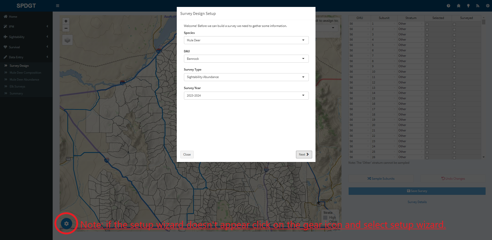
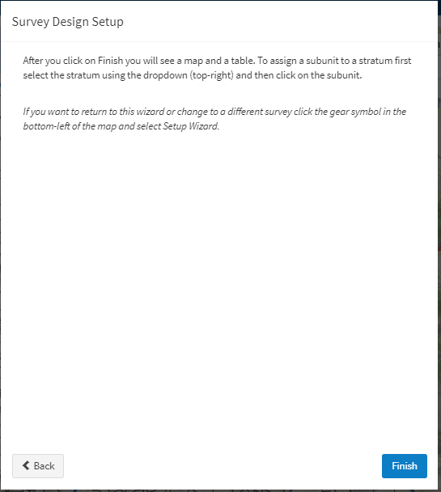
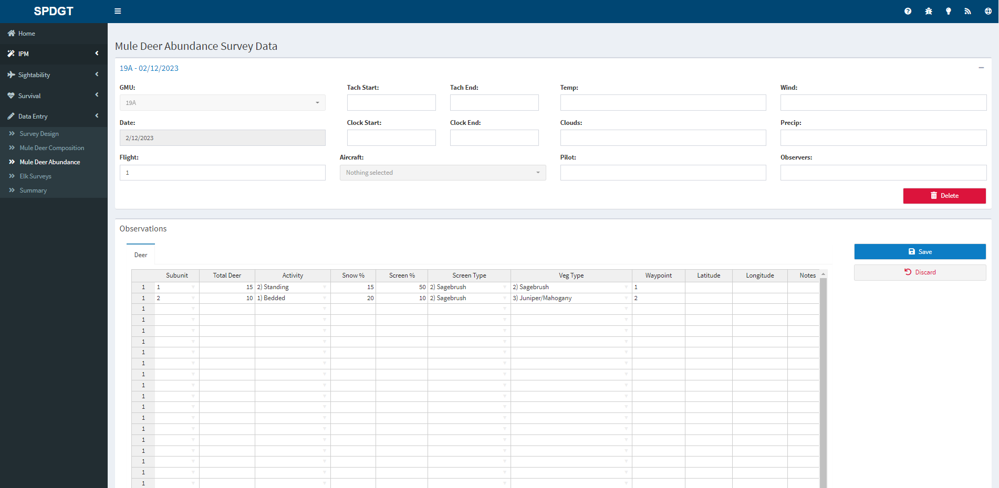

--- 
title: "Data Entry"
---

# Data Entry {#dataentry}

The Speedgoat asdf website allows users to design sightability/composition surveys and enter survey data directly into the Speedgoat survey database.The data entry functionality requires users to set-up an abundance or composition survey using stratified sampling, and enter the resultant data from the survey so the survey design is saved with the survey data. The data can then be use in the sightability model and thus directly populate the IPM Database. To enter survey data, the user must 1) create a survey design and 2) enter data from the survey.

## Survey Design {#dataentry-survde}

The first step to entering survey data is to create a survey design. To get started click on **Data Entry** on the sidebar and then click **Survey Design** from the drop-down menu. To begin, you need to specify the **Species**, **DAU**, **Survey Type**, and **Survey Year** that you want to design. Once this information is entered, the map will zoom to the selected DAU showing the DAU and corresponding subunits. If the Subunits within the DAU have previously been stratified into High and Other strata, the strafication will be visible on the map, and in the table to the right of the map. To update the subunit's strafication, you have two options. 1) You can use the box in the upper right hand corner of the map titled **Click subunit to assign to:** to select a stratum you want to apply to a subunit, and then click the Subunit on the map. Once the subunit is clicked, it will change color to the selected stratum. Or, 2) you can use the table to the right of the map to change the strata.  By clicking in the stratum column next to the subunit you would like to change, you can select the desired strata from the drop-down menu. 

Once the DAU is correctly stratified, you can create a survey by clicking on the <b>Sample Subunits</b> button. This will open a window allowing you to specify the time it take to fly one subunit, the proportion of each strata to sample, and the Sampling Method.The survey design tool allows you to randomly sample subunits within the DAU using either **Random** or **GRTS** sampling. GRTS (Generalized Random Tesselation Stratified) sampling is a spatially-balanced sampling framework. When changes are made in the **Time to fly one subunit** or the **Proportion of High to Sample**, these will result in changes in the Subunits to fly and the total flight time in the table at the bottom of the pop-up window. Once these decisions have been made, you can then click on the <b>Sample</b> button. The subunits selected to be sampled with have a blue circle on the map and will have a check box in the **Selected** column of the table. You can then click on the <b>Save Survey</b> button to save the survey. Once the survey is saved, you can view the survey details by clicking on the **Survey Details** button.

Once the survey is flown, you must confirm that all subunits selected to be flown in the survey design were in fact surveyed. allowing the sightability model to correctly extrapolate the results of the survey to the entire DAU. To record which subunits were surveyed, check the box in the **Surveyed** column by clicking on it.  This completes the survey design process.

## Step-By-Step Survey Design Example {#dataentry-survdeex}

1. Start by clicking **Data Entry** in the sidebar.

2. Select the **Survey Design** page in the sidebar, then select the species, DAU, Survey Type, and Survey Year you want to design. In this example we design an abundance survey for Mule Deer in Bannock for survey year 2023-2024.

NOTE: If the setup wizard does not appear when Survey Design is selected, click on the gear icon in the lower left corner of the map and select **Setup Wizard**.

3. Click the button labeled "Next" to complete the Survey Design Setup and then once you have read the instructions for updating stratification of the subunit, click on the button labeled "Finish".

4. To change the strata assigned to a subunit, you have two options. 1) You can use the box in the upper right hand corner of the map titled **Click subunit to assign to:** to select a stratum you want to apply to a subunit, and then click the Subunit on the map. Once the subunit is clicked, it will change color to the selected stratum. Or, 2) you can use the table to the right of the map to change the strata.  By clicking in the stratum column next to the subunit you would like to change, you can select the desired strata from the drop-down menu.

5. To design the survey, click on the button labeled **Sample Subunits**

You can then select the time it takes to fly one subunit, the proportion of each strata to fly, and the sampling method. You can use the table at the bottom to determine the expected flight time of the survey and the number of subunits to fly in each strata before you click on the **Sample** button to sample which subunits to fly within the DAU. You will notice that those subunits selected will have a blue circle on the map and will have a check mark in the "Selected" column of the table. NOTE: subunits with strata Other will not be selected.

6. You can then save the survey by clicking on the button labeled "Save Survey". 

7. Once the survey is flown, you will need to update the survey design to specify which of the selected subunits were actually flown. A red dot will indicate flown subunits on the map. Once surveyed subunits are marked, click "Save Survey" to save your edits.

You can now enter your survey observations!

## Data Entry Mule deer Composition, Mule Deer Abundance, and Elk Surveys {#dataentry-survdatent}

After you have collected data from a composition or abundance survey, you can enter the data under the corresponding data entry tab by selecting **Mule Deer Composition** or **Mule Deer Abundance** under **Data Entry** on the sidebar. Start by entering the GMU surveyed, the date of the survey, and the flight number. You can enter meta associated with the flight, but in order to save the survey data, GMU and Date are the only meta data needed. Once the meta data has been entered, click on the <b>Save</b> button. Once the meta data is saved, observations from the survey can then be added in the **Observations** table. If this data has already been entered in a different spreadsheet, you can use keyboard shortcuts to copy and paste directly into this table (for PC users ctrl + c to copy and ctrl + v to paste). If each observation has a waypoint that corresponds to coordinates from the GPS used during the flight, these data can be uploaded by clicking on **Add GPS Data** in the upper right corner of the Observations box. You can then use Browse to locate the file containing the GPS positions and load the waypoints directly to the data table to avoid errors associated with typing out Latitude and Longitude. To view a summary of the survey data entered, click on **Totals** in the upper right hand corner of the **Observations** box.  Other species observed during the survey can be entered in the **Other Species** table located below the **Observations** table. Once all the data has been entered, click on the <b>Save</b> button. If there are errors in the data entry such as differences in the Total Deer and the sum of the classified animals, a warning will pop-up highlighting the errors in red. Changes cannot be saved unless these errors are resolved.

## Step-By-Step Data Entry Example {#dataentry-survdatentex}

1. Start by clicking **Data Entry** in the sidebar.

2. Next, select the survey type from the sidebar

3. In order to begin data entry, you must fill in meta data for the survey including GMU, Date, and Flight number. Once this information is populated, you can save the meta data by clicking "Save" and begin entering observations.

4. Enter data into the Observations table using drop-downs within the cell. If you have already entered data in a spreadsheet you can copy and paste using the copy and paste shortcut keys (PC users ctrl + c to copy and ctrl + v to paste). You can then click "Save" to save the observations to the database. 

5. Once the data is saved, you have the option to add GPS data to the observations linking the waypoints entered for each observation in the table to Latitude and Longitude from a separate file to avoid errors in typing Latitude and Longitude. 

Follow the instructions in the pop-up window to load the waypoints and link the GPS locations to the waypoint names in the Observation table.

6. To maintain transparency and keep all pertinent information in one location, You can also attach files to survey data. These can include flight paths and .pdfs of the raw data forms for future reference.

7. Finally, once the observation data are saved, you can view a summary of the survey by clicking on the "Totals" button.

