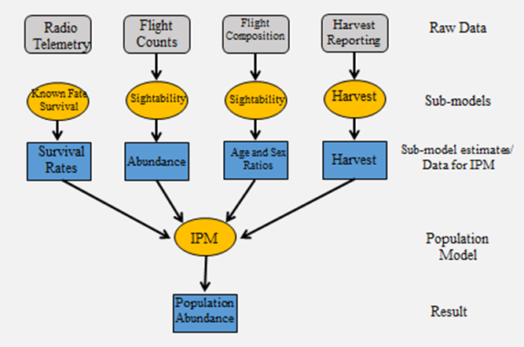

# General Information {#popr-info}

To get started with PopR, visit the [Speedgoat homepage](https://www.speedgoat.io/) and select Idaho from the login menu.

PopR allows you to combine data from various sources to model wildlife populations using an integrated population model (IPM), leading to more robust and defensible estimates. First the data from each source are modeled independently to estimate individual population parameters, such as sex ratio and survival. Then these results are combined in the IPM to find the best fit for all of the available data.

