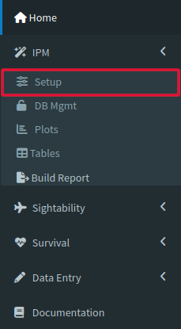
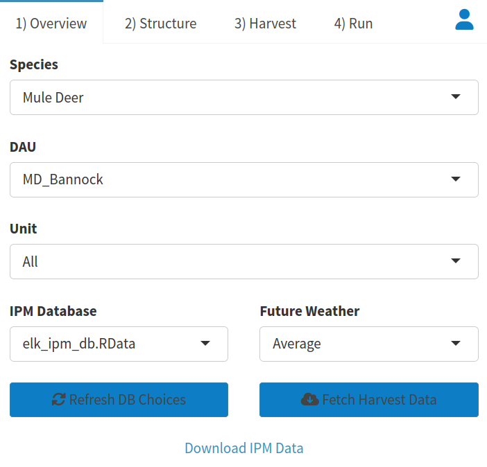
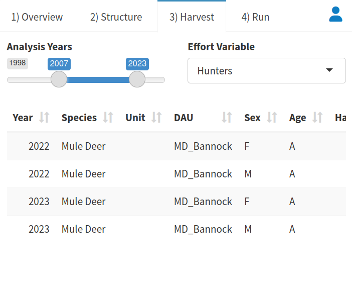
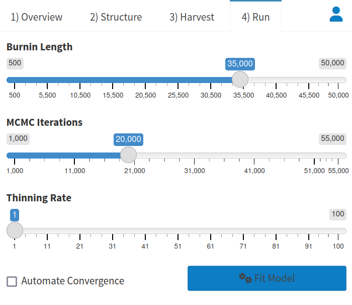
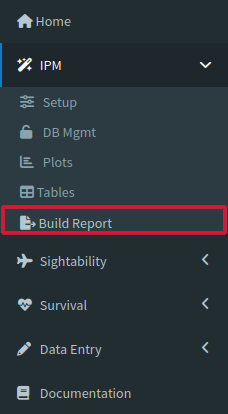
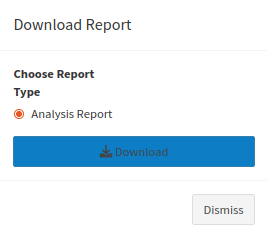

# IPM {#ipm}

An IPM, or Integrated Population Model, combines data from many sources in its analyses for the sake of  estimates that acknowledge the many factors that can influence abundance and survival. Our IPM uses data from survival and sightability models, as well as harvest data from the IDFG database to calculate rates like survival and sex ratios for an entire [<b>DAU</b>](#gl-dau){style="color: #086e04;"}, extrapolated to the entire unit and better informed by all the different metrics that are considered in the process of fitting the model.

## Walkthrough {#ipm-model}

Using the IPM tool can be split into two major processes: preparing data and looking at data.

### Preparing Data {#ipm-load}

Click on the Setup tab, the first dropdown under the IPM tool menu.

On the top left of the page should be a window labeled Overview, and this is where you determine the data that you run through the IPM. Select the database you want to retrieve the data from, then make sure you choose your Species, [<b>DAU</b>](#gl-dau){style="color: #086e04;"}, Unit, and Weather before you click [<b>Fetch Harvest Data</b>]{style="color: #196eb0;"} on the bottom right of the Overview window to retrieve the specific data you requested.

Once the data is loaded, you should get a popup dialog letting you know that the process was successful. It will also prompt you to proceed to the "Structure" tab (At the top left of the page next to the Overview tab), which is where we will continue our data preparation.

The Structure tab allows you to select whether your survival and reproduction will have a constant or time varying data variance. The defaults were chosen to be well-suited to a variety of situations, so most of the time clicking [<b>"Default Structure"</b>]{style="color: #196eb0;"} will be all you need to do here. Often the inputs that appear when the tool is opened are actually not the same as those that are selected when you press [<b>"Default Structure"</b>]{style="color: #196eb0;"}, so make sure you click that before you move on to Harvest if those are the inputs you are planning to use.

After you select your Structure, you can move on to the Harvest Tab. Decide your effort variable and the years that you will be conducting your analysis, then look at the given information for the years that will be forecast. You can change the Harvest by double clicking the numbers and typing in new entries.

Our next step is the Run tab, which again already has a decent set of default values loaded. Adjust your Burnin Length, MCMC iterations, and Thinning Length. Decide whether you would like to automate convergence (This may increase the time it takes to run the model).

Once you are satisfied with all of the inputs outlined above, click [<b>Fit Model</b>]{style="color: #196eb0;"} to begin analysis. This should take some time, but you will get a dialog box letting you know when the process is complete

### Looking at Data {#ipm-look}

(NOTE: This section will only work if you completed the steps above to prepare your data and fit your model beforehand.)

To look at the data you prepared, wait until the model that you initiated in the setup tab has finished running, then go ahead and click the Plots tab on the IPM dropdown menu to check the results. Hovering your mouse over a point on a plot will give you the parameter, year, age, sex, control limits, and mean associated with the dataset that created the data point.

You can also check the model output by clicking the Tables tab right below the Plots one on the IPM dropdown. Rhat values greater than 1.1 are highlighted in red, which means the model may not have converged and should be run again after modifying the settings on the Run tab in the Setup tool. The first ten entries that appear when you open the table tab are not the only outputs of the model. You will notice that you may navigate the pages with the list to the bottom right, or you may increase the number of entries visible at the top left of the page, using the [<b>Show (10) Entries</b>]{style="color: #196eb0;"} dropdown.

As a final step to get more diagnostic information, use the Build Report tool. 

Simply click on the tool and then click the download prompt on the popup window. The resulting document contains interactive plots as well as model specifications and fit.

## Reference {#ipm-ref}

### Setup {#ipm-setup}

The main purpose of the Setup tab is to load and preview data that will be used for later analysis, and we will spend more time describing each element in detail. The window on the top left of the page has several tabs related to data preparation labeled Overview, Structure, Harvest, and Run.

The Overview tab helps you find the data you will be loading for your IPM. Make sure that you are pulling from the correct database! Also, the Future Weather dropdown allows you to consider weather in your IPM analysis. Average assumes mean observed weather conditions, Good assumes upper 95% quantile of observed weather, and Bad assumes lower 5% quantile of observed weather. You may also choose not to include weather in your analysis. All of these values were developed from the dissertation of Mark Hurley.

The Structure tab gives our model some information about assumptions. Population reconstruction is the process of estimating past abundance using a combination of known harvest data and estimated natural mortality rates. If you know when an animal died AND how old it was when it died, then you also know when it was alive. Using this "back-tracking" can create an abundance estimate for past years even if one was not carried out.

The Harvest tab gives our model some important context on harvest metrics. The slider at the top tells our model which years are being analyzed. The effort variable allows us to choose whether effort is determined by the number of days in the field or the number of hunters themselves. It also gives more context to our harvest numbers and helps us tease apart the relationship that hunter effectiveness and raw number of hunters had on the harvest that year. You may also give hypothetical harvest numbers for our model to consider so you may estimate the effects of management decisions on rates like survival and abundance.

The Run tab gives direction to our actual modeling process. The given settings control how we deal with the many thousands of times the model must run to calibrate itself. Burnin Length helps us focus our model. When the MCMC model begins running, it checks possible outputs of the model and begins sampling them to determine the probability that they will represent our data. The model uses past sampled points to try and get an idea of where the highest probabilities are, but when the model first begins running it does not have the luxury of these reference points. This sets up the model's first few samples to be more randomly chosen than any part of the process, meaning that the beginning samples are less likely to be on high probability outputs. Burnin Length helps us get around this by deleting the first runs of the MCMC model after it's done running. MCMC iterations is simply a measure of how many different times the model will test the probability of different model outputs. More sampling allows the model to consider more options and therefore can increase the chance that the model will find the outputs with the highest likelihoods, but it also may not be necessary and will make the tool take longer to run. Thinning rate helps us save memory by deleting entries from the model's stored runs. We can think of this as a sort of browser history for the model, showing us how it got its answer. In this case there are literally tens of thousands of steps, so deleting a small (or large) proportion of that history and using what is left still gives us an idea of the model's actions without taking up nearly as much memory. The slider is the percentage of model iterations that will be deleted once the modeling process is complete.

The window on the top right of the page is for previewing data after it is loaded but before the model is run. Hovering your cursor over data points will give you all relevant data. You can change your view of the data using the pan and two zoom features on the side of each graph. Click the reset button to return to the original view. The table at the bottom of the page gives another way to preview the data you loaded in the Overview tab. You can organize your data by any of the column headers, and note that you can navigate and view more of your data with the previous and next buttons at the bottom of the page.

### Database Management {#ipm-dbmgmt}

The DB Mgmt tab creates, deletes and edits databases.The tools may be minimized, but to open them for use just click on the plus sign on the right side of the box containing the tool. Press it again to minimize it. Note that because databases are shared between users, edits here will change databases for EVERYONE. Data losses and changes will be permanent if you do not back up your data. You can also use the Create tab to make a new database.

You can enter your information manually using the blank table at the bottom of the tool window, but you may also paste data from a spreadsheet app like Excel. You can also start off with data from any existing database, which you can select under the Historic Data box. Make sure to give your new database a name, and then click the create database button to add a database to the Speedgoat server! You can also use the download tool to get the data you have loaded into our servers as a .csv.

The Delete DB tool will delete the database you select from the server. Deleting it here will delete it for everyone, so make sure that your data is backed up and that nobody is still working on a database before you delete it.

The Edit tool allows you to add and delete rows of data from the database selected in the menu at the top of the tool. None of the edits you make will be applied until the Save Changes button is clicked, but once that button is clicked changes will be applied for everyone that uses that database.

### Plots {#ipm-plot}

The plots page has graphs that are created by running your selected data through an IPM. Use the zoom and pan tools to change your view of the graph, and use the reset button to return to your original view.

### Tables {#ipm-table}

On the Tables page you can download and edit the data you are using for analysis. You can download your data here as well, but note that you will only download the data being displayed to you. By default, the table only shows the first ten entries of your dataset, so if you would like to download your data here make sure you change the dropdown at the top of the window from Show 10 entries to Show All entries.

### Build Report {#ipm-report}

The Build Report tool gives a summary of the analysis conducted, while keeping relevant information like model settings for future comparisons.
