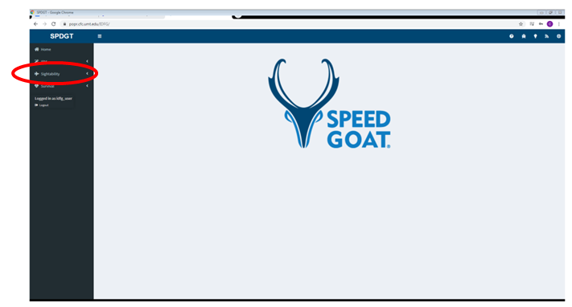
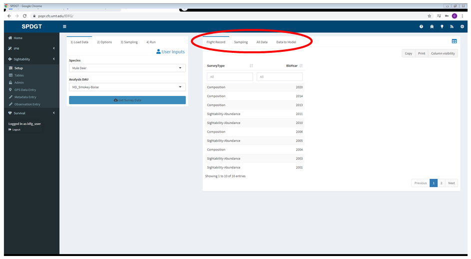
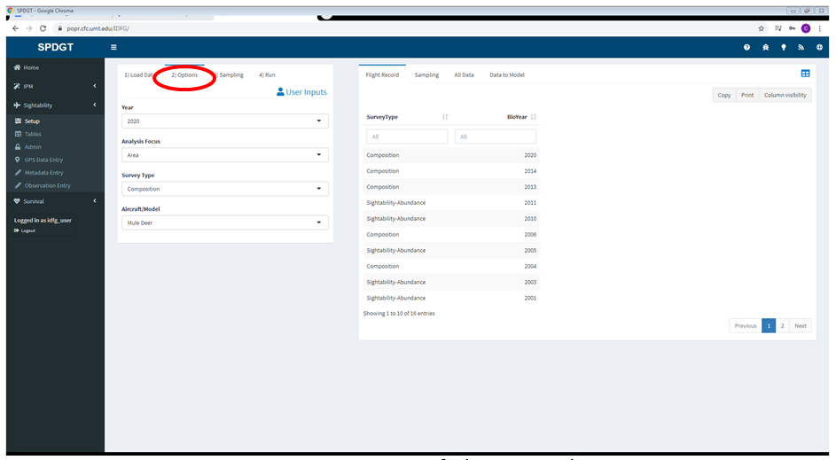
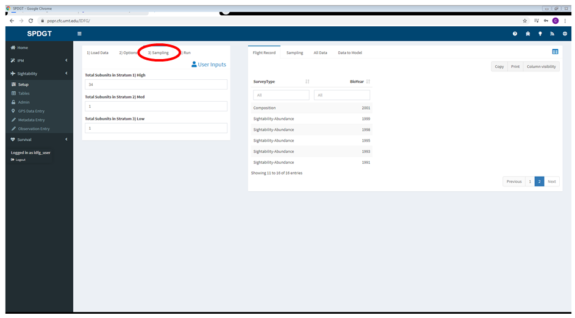
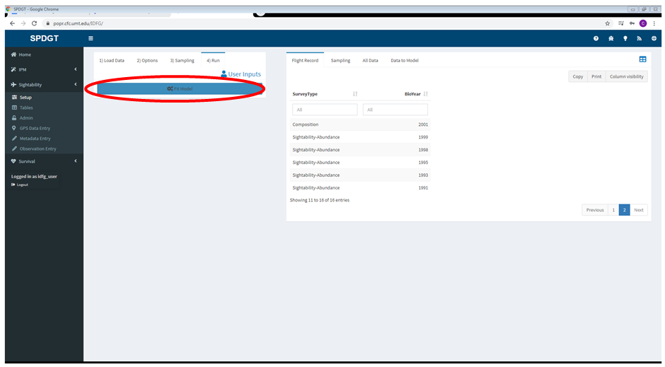
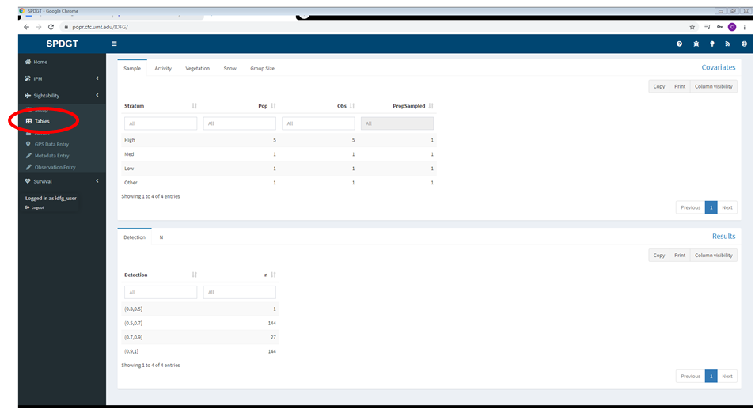
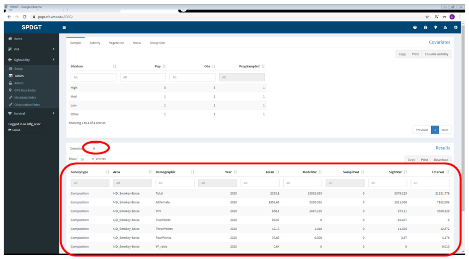
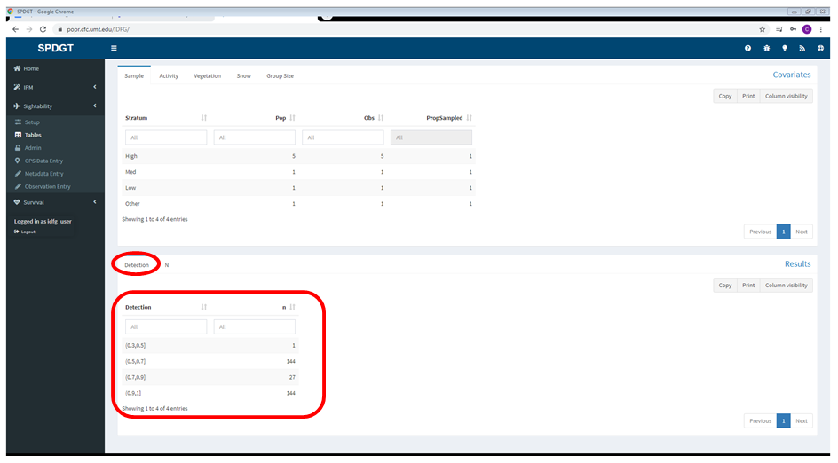
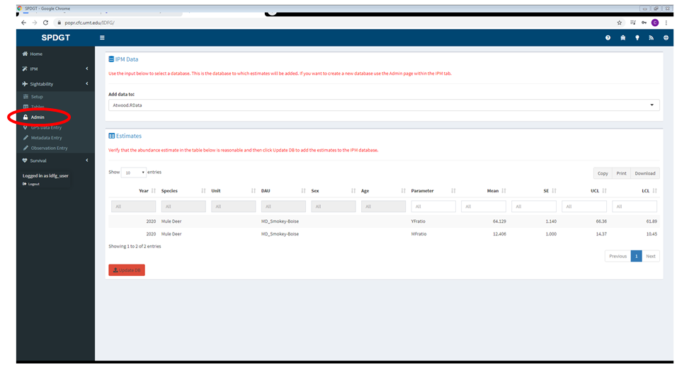

--- 
title: "Sightability"
---

# Sightability {#sight}

Sightability models use aerial survey data combined with detection probability models to estimate total abundance within a sampling unit.

The basic idea behind sightability is a fairly simple process. First the sightability of the group is estimated by taking the covariate values and previously estimated coefficients. For example, if the model had one covariate called veg and the value of veg for a given observation was .8 then we can estimate sightability with something like:

$logit(sight) = 1.1 - 0.6 * veg$

Here the average sightability is something like logit(1.1) or 0.75 and the effect of veg is roughly -0.6, so if we plug in our observation of 0.8 we would get

$logit(sight) = 1.1 - 0.6 * 0.8$

The value of sight is then 0.65. Now let’s say that the group had 10 animals that were observed from aircraft. The estimate for the group size is 10/0.65 or about 15 animals. That is the adjustment applied to each group.
To conduct a sightability survey a manager would first define the desired scope of inference, say a DAU. Within the DAU there are GMUs and subunits. The area is then stratified based on previous observations and snow cover. For the sake of an example let’s say we have 100 subunits and we have decided that 60 are in the high stratum, 30 are in the medium and 10 are in low. Within each stratum we have to decide how many to sample. If we decide to sample all of the highs, half of the mediums, and a quarter of the lows then we will have 60 high, 15 medium and say 3 low subunits to fly. 

With data in hand we can estimate sightability as outlined above and then we will extrapolate those numbers to all of the areas that were not sampled. For simplicity, say our sightability adjusted estimates for each stratum were 250, 75 and 10 for high, medium and low respectively.

The general idea behind extrapolating is straightforward. To know what area was we simply divide the number of subunits flown by the population of subunits within a stratum.

High: 60/60 = 1

Medium: 15/30 = 0.5

Low: 3/10 = 0.333

Now to use this number we will divide the adjusted number of animals by the proportion of subunits flown

High: 250/1 = 250 animals

Medium: 75/0.5 = 150 animals

Low: 10/0.333 = 30 animals

This example hopefully shows the importance of sampling and how critical it is to know what stratum an observation came from. Without the stratum we cannot know the proportion of the area sampled and cannot make an estimate relate back to the population of subunits.

The extrapolation step also demonstrates that the density of animals is assumed to be constant. In the case of the mediums the area sampled produced 75 animals and it is assumed that the unflown subunits with the medium stratum are the same, which is how we get away with dividing by the proportion of area sampled. If a biologist only flies subunits where they know there are lots of deer then that number will be extrapolated to the remainder of the GMU and DAU.

## Sightability Data Entry {#sight-de}

There are 3 separate tabs available for entering sightability data. The GPS tab allows you to upload waypoints from a GPS file, the metadata tab allows you to add information about the overall survey, and the observation tab allows you to enter the actual counts.

When entering sightability data keep in mind that the model won't work unless the number of subunits sampled and the number of subunits available in each strata are defined accurately. It's critical to enter this information correctly on the metadata and observation entry tabs, including entering observations of 0 animals for subunits that were flown but where no animals were found.

### GPS Data Entry

The first step in entering sightability data is to upload GPS data for your survey (if you don't have a .csv file containing GPS data for your survey you can skip this step). To get started click **Sightability** in the sidebar, then **GPS Data Entry**.

#### GPS data definition {-}

To successfully upload your GPS data to PopR, the data must be in the following format:

|Title | Date Created | Latitude | Longitude|
|------|--------------|----------|----------|
|1 | 2016-12-06 09:39:19 AM MST | 44.93516298 | -113.6274062|
|2 | 2016-12-06 10:05:37 AM MST | 44.90122665 | -113.6149363|

* The first column is named Title (case sensitive) and contains a number that can be used to index the points
* A column representing Latitude, which must be named Latitude (case sensitive)
* A column representing Longitude, which must be named Longitude (case sensitive)

Any GPS data following these rules should work with the program.  Note also that the data are collected in decimal degrees and assumed to be WGS84 with a negative Longitude value.

To upload GPS data:

1. Click Browse towards the upper left of your screen
2. Select the file containing the GPS data you wish to use
3. Click Open
4. Click the <b>Write to DB</b> button when satisfied that the data is accurate (if a file by the same name already exists the user will be prompted for a different name)

Once you have selected your file a table should appear at the right of the screen.  This table can be copied to your clipboard, printed, downloaded and columns can be hidden for easier viewing.  The table can also be sorted by using the arrows next to the column names.  Filtering the table is also possible using the boxes at the top of each column. If you don't like the order of the columns try clicking on a column name and while holding the left mouse button dragging the column to the location you prefer.  In addition to the table a map of the points is rendered.  The map is intended as a quick check of the feasibility of the points.  In order to help the user better understand where the locations were recorded there are three different potential map layers available via the button in the top right corner of the map.  The map itself is also interactive.  The user may navigate with their mouse by clicking and dragging.  Zooming is accomplished by the buttons in the top left of the map or by scrolling the mouse wheel.  One tip when using the mouse wheel, if your mouse is over the map the map will zoom, but if your mouse is anywhere else the webpage will scroll.

####  Where are my files? {-}
After clicking on the Browse button in PopR you should see a typical file explorer window.  If you then click on My Computer your device should be visible.  From this point you can navigate to the location of the files on your device and select the files one at a time.  If you click on your device there are no files visible try changing the USB settings.  To do this, on an Android device, drag your finger down from the top of the screen and select _Transferring images via USB_.  Once selected you should see a popup that allows you to select one of several options.  Toggle the options until you can browse the file structure of your device.  For more help with this process or if your device is a Mac or iSomething try [this link](https://support.google.com/nexus/answer/2840804?hl=en).  Note that the MTP connection does not always work for me and so I often use the via PTP option.

On an Android device the typical location of files is something like: 
Computer > Galaxy Tab S2 > Tablet > Documents or Download

### Metadata Entry

The next step is to enter the metadata for your survey. The Mmetadata entry tool exists to define the survey and prevents the user from having to so re-enter data that remains constant for a survey period. For example, the total number of subunits available to sample in each stratum remains constant over an entire survey period (generally a single year).

Click **Metadata Entry** in the sidebar under **Sightability**, then select the species and [survey type](#gl-sight-survey). Enter the date the survey took place, the type of [aircraft](#gl-aircraft) used, and the number of observations (rows) recorded on the datasheet. Select the region and analysis unit, and if you uploaded a file in the previous step, select it in the GPS Data File input. Enter the total number of subunits available in each [density stratum](#gl-stratum) (not the number flown), and finally enter any comments or notes about the survey. Once the form is complete click the <b>Submit Response</b> button to continue. A dialog will appear confirming that the data were saved.

If you made a mistake on the Metadata form you can correct it on the Past Surveys tab. This tab presents a spreadsheet with all of the survey metadata entered to date. You can delete rows by right-clicking or edit the information in any of the fields. If you make changes on the Past Surveys tab make sure to click the <b>Save Edits</b> button when you're finished.

### Observation Entry

Once the Metadata is entered correctly click **Observation Entry** on the sidebar, then click the <b>Load</b> button to get started. Use the inputs in the dialog that appears to select the survey you entered in the previous step, then click <b>Load Data</b>. A spreadsheet will appear with the Species, Survey Type, Date, and Area populated for you. Fill in the additional columns (beginning with Stratum) with the information from your datasheet. You may need to use the horizontal scroll bar below the spreadsheet to access all the columns if they don't fit on your screen. The number of rows available in the spreadsheet will match the number of observations you entered in the Metadata form, but if you need to add additional rows you can do so by right-clicking in the last row and selecting "insert row below." You can view a summary of the data you've entered below the spreadsheet.

The observations entered here are used to determine which subunits were actually sampled, so it's critical to enter an observation for every subunit that was flown, even if the number of animals counted is zero.

Once all the data from your datasheet has been added to the spreadsheet click **Validate** to check for [errors](#sight-errors). If any errors are present a dialog will appear explaining what they are and how to fix them. Once any errors are corrected use the <b>Save</b> button to save the data to the server.

## Running a Sightability Model {#sight-model}

### Loading Data {#sight-load}

To run a sightability model select **Sightability** in the sidebar then click **Setup**. Select a species and [DAU](#gl-dau) on the Load Data tab and click the <b>Get Survey Data</b> button to download data from the IDFG database. Once the download is complete a dialog will confirm that the data has been downloaded and alert you to any errors present in the data (see the [errors](#sight-errors) section). Data will only be read for the species and DAU selected, so if you switch either selection later you'll have to repeat the process.

Once the data is downloaded you can review it in various formats in the pane to the right.

* Flight record: Summarizes the data downloaded by [survey type](#gl-comp-survey) and [bio year](#gl-bio-year).
* Sampling: Summarizes the data downloaded by [stratum](#gl-sight-stratum), showing the population of units available and how many of those were sampled. This is a great table to check against your expectations - how many high, medium and low subunits did you fly? Does the data match? This is also a good place to make sure the stratum and unit were entered correctly for all of your observations - missing values in those columns are a common cause of [errors](#sight-errors).
* All Data: Shows all of the observation data downloaded for this species and DAU.
* Data to Model: Shows the observation data as it will be passed to the model for transparency.
  
If any errors appear in the data you can correct them through the **Metadata Entry** or **Observation Entry** pages in the sidebar. If you make any corrections be sure to load the data again when you return to the **Setup** page.

### Model Options {#sight-options}

After loading sightability data for a particular species and DAU move on to the Options tab to specify the parameters for your model. Select a year from those available in the data, then choose whether to analyze by [area](#gl-area), [unit](#gl-unit), [stratum](#gl-stratum), or [sub-unit](#gl-subunit). It's important to note that your results cannot be used to extrapolate to a wider geographic area if you select unit, stratum, or subunit in this dropdown. Finally select a [survey type](#gl-sight-survey) and [aircraft](#gl-aircraft) - the available selections for these may be limited based on the species selected.

Move on to the Sampling tab and review the values displayed. The population of subunits within each stratum (the total number) is shown to the user in the pop column. The number of subunits flown as part of the sample are displayed in the obs or observation column. Recall that the model will extrapolate the estimates based on the proportion of the total area that was sampled. The proportion is calculated by dividing the number of subunits where observations were made by the total number of subunits and is shown to the user in the last column, PropSampled. For example, the expectation is that high is close to 1, medium is close to 0.5 and low is something lower like 0.25. In the case that zero observations were made within a stratum a 1 will be inserted. This is because division by 0 is not possible. Extrapolation is performed by taking an estimate and dividing by the proportion sampled, so if we insert a 1 for either a census or a place where no observations were made the result is that no extrapolation is performed.

When you've selected the appropriate options and adjusted the sampling parameters (if necessary to achieve correct proportions sampled) move on to the Run tab and click <b>Fit Model</b>. If no errors are encountered dismiss the dialog and click **Tables** in the sidebar to view your results. If the model fails to run check the [errors](#sight-errors) section.

### Model Output {#sight-output}

Once you've run a model you can view the results on the **Tables** page. The top half of the page shows the data used in the model, summarized by category:

* Sample: Displays how many [subunits](#gl-subunit) were available in each [stratum](#gl-stratum), and how many of those were sampled.
* Activity: Displays the number of observations for each [activity](#gl-movement) category.
* Vegetation: Displays the number of observations for each [vegetation type](#gl-veg).
* Snow: Displays the number of observations binned by [snow cover](#gl-snow).
* Group Size: Displays the number of observations binned by [group size](#gl-group-size).

The bottom half of the page shows the model output:

* Detection: Displays the probability of detection (as a range) assigned to the input observations.
* N: Displays the abundance estimates produced by the model by [demographic](#gl-demographic), including the [variance](#gl-variance) for each estimate.

### Adding Results to IPM {#sight-admin}

Use the **Admin** page to add the results of your sightability model to the input data for the IPM. Only add the results to an [IPM dataset](#gl-ipm-db) if you're sure you used the correct settings and data. If there is already sightability data in the IPM data file you select for the same year and unit, that data will be overwritten with the results of your current model. If you ran a model on [composition survey](#gl-comp-survey) data, sex and age ratios will be added; for [sightability surveys](#gl-sight-survey) abundance estimates will be added.

Select the [IPM dataset](#gl-ipm-db) to which you want to add your estimates, and verify that the estimates themselves look reasonable, then click <b>Update DB</b> to add the estimates to the database file.

### Errors {#sight-errors}

###### Reporting errors {-}

This section of the documentation is a work in progress. We need your feedback to identify and document the errors users commonly experience running models with PopR - you can help us by sending an email to  [eric.newkirk@speedgoat.io](mailto:eric.newkirk@speedgoat.io?cc=josh.nowak@speedgoat.io&subject=PopR%20Error) any time you experience an error on the site. Please include as much information as you can about your settings, data, and the error message you received, including screenshots if possible. Thanks!

###### Missing values in the stratum or unit fields {-}

These errors should be apparent when reviewing the data in the **Sampling** tab of the **Setup** page. Missing values in these columns can cause data to be discarded or cause the model to fail. To fix them navigate to the **Observation Entry** page, load the data for the survey in question, and fill in the missing information. Don't forget to click the button to save your changes when all the values have been entered.

###### Empty rows at the bottom of the observation table {-}

Sometimes when the metadata and observations entered for a survey don't agree there can be empty rows at the bottom of the observation data entry table. If that happens load the survey data in the **Observation Entry** page and right-click on the empty row(s) to delete. As above, don't forget to save your changes.

## Step-By-Step Sightability Model Example {#sight-ex}

This example shows how to run a sightability model for mule deer in the Smokey-Boise DAU step by step, including screenshots of the website.

1. Start by clicking **Sightability** in the sidebar.

2. Select the **Setup** page in the sidebar, then select the species and DAU you want to model. In this example we use mule deer and MD_Smokey-Boise. Make sure to select the correct species and DAU before clicking the button to load sightability data.

3. Click the button labeled "Get Survey Data" to load the data for the species and DAU you selected.

4. Once the data is loaded you should see a dialog indicating that the process was successful. Click Dismiss. If you receive an error see the [errors](#sight-errors) section.

5. Review the data in the panes to the right (see [Loading Data](#sight-load) for details).

6. Move on to the [**Options**](#sight-options) tab in the **User Inputs** pane, and make the appropriate selections. In this example we run a model on 2020 composition data for mule deer, with area as the spatial focus of the analysis.

7. Move on to the [**Sampling**](#sight-options) tab and check that the data are accurate by selecting Sampling in the pane to the right. If the total population of subunits available in each stratum is incorrect you can fix it here.

8. Now that you've selected the appropriate settings and reviewed the input data, switch to the **Run** tab and click <b>Fit Model</b>.

9. Once model fitting is complete select the **Tables** page in the sidebar to view the output.

10. The covariates section on the top half of the page summarizes the observations used in the model and how they fall into the various strata, activity categories, etc. See [Model Output](#sight-output) for more details.

11. Select the **N** table on the bottom half of the screen to view abundance estimates.

12. Select the **Detection** table to view a summary of observations binned by probability of detection.

13. If you're confident in the results and the settings used to run the model, you can add the sightability results to an [IPM dataset](#gl-ipm-db) using the **Admin** tab in the sidebar. Be sure to read the [instructions](#sight-admin) and understand the difference between the various IPM databases before using the admin tab.

