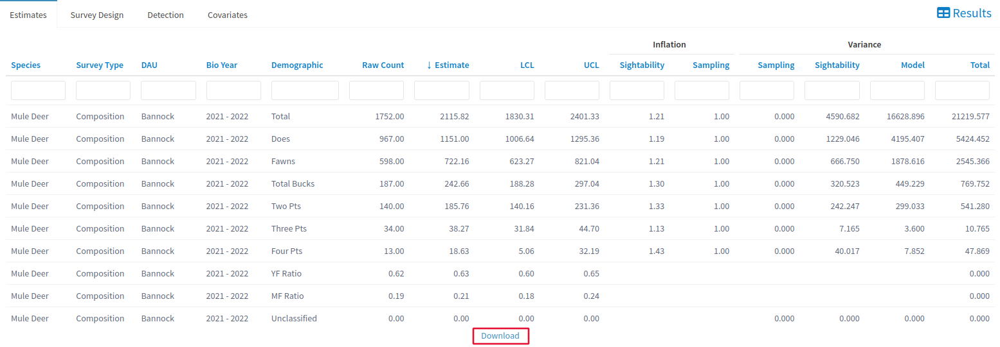

--- 
title: "Sightability"
---

# Sightability {#sight}
  Sightability models estimate abundance in a unit by combining the number of animals that we have seen in aerial surveys with an estimated number of animals that we have NOT seen using detection probability models. These detection models consider ground vegetation, the animal’s activity, snow cover, and the size of the group of animals to determine the likelihood that an animal is seen with the interference of these variables. 

  Stratum are used to organize habitat subunits by how well they would work as habitat for the animal being surveyed. The “high” strata group represents subunits that contain the best habitat, “low” is the group that has the worst habitats, and “medium” falls in between. Subunits are determined by previous observations from biologists and snow cover.

## Walkthrough {#sight-walk}

Using the Sightability tool can be split into two major processes: preparing data and looking at data. 

### Preparing Data {#sight-prep}

  To prepare the data, navigate to the Setup tab under the Sightability dropdown. 
  
  

  
  Within the setup section, the User Inputs window decides which survey data you will load. Select your species, [<b>DAU</b>]{style="color: #086e04;"}, Survey Type, Year, Analysis Focus, and Aircraft/Model. The data preview on the right side of the page will update as you adjust your settings. Check it as you make your choices in the User Inputs window, but you do not have to modify it any further. 
  
  

  
  

  
  Once you are satisfied with your choices in the User Input window, go ahead and click [<b>Fit Model</b>]{style="color: #196eb0;"}. You will get a dialog box letting you know when the tool ran successfully.

### Looking at Data {#sight-look}

  Now that your data has been prepared you can go to the Tables tab, which is where you can view the output of your model. 
  
  

  
  Navigate with the tabs along the top of the screen to check your estimates, survey design, detection, and covariates. You can also download your detection and estimation results as .csv files with [<b>Download</b>]{style="color: #196eb0;"} at the bottom of the table. 
  
  

  
  To get a more detailed report of your model that includes the information in the Tables tab while keeping track of things like model settings, click the Build Report tab under Sightability. A prompt will appear asking you to download the report as an html file. 
  
   

  
  

  
  If you would like to upload the results of your model to an IPM database, you can click on the Admin tab. 
  
  

  
  EDITS HERE WILL EDIT DATABASES FOR EVERYONE. You can select the database that you want to upload your data to, as well as review the information that you will be uploading. Press [<b>Update DB</b>]{style="color: #196eb0;"} to add your selected results to a shared database.
  
  

## Reference {#sight-ref}

### Setup {#sight-setup}

  The setup tab is used to select which [<b>DAU</b>]{style="color: #086e04;"} will be run through our model.
  
  The User Inputs tab on the left side of the screen allows you to specify which data we will be analyzing. Surveys will only appear if they are a perfect match to all of the dropdown menus, so make sure to double check that you did not accidentally leave one of them as default if the survey you are looking for refuses to appear in the preview window. The species dropdown allows to to choose whether you are selecting elk surveys or mule deer surveys. 

  The Analysis DAU dropdown selects which region of Idaho we will be analyzing. All DAUs in Idaho are included as options for a survey, but this does not necessarily mean that surveys from every DAU have been uploaded to the speedgoat database. If nothing appears in the preview window on the right side of the screen when you select a DAU, then it means there is no data available. The Survey Type dropdown includes both [<b>composition</b>]{style="color: #086e04;"} and [<b>sightability-abundance</b>]{style="color: #086e04;"} surveys. The year tab refers to which Biological year the survey was carried out on. Years are referred to as “2016-2017” rather than just one year because surveys are generally carried out between late fall and early spring, which straddles new year’s. This makes more sense to keep related surveys together because two surveys may be flown only three weeks apart but still be lumped into separate years. If you are having trouble finding your survey, make sure you select the right time range, since a survey flown in 2016 could be in the 2015-2016 group OR the 2016-2017 group. The Analysis Focus dropdown determines what scale the analysis will be carried out within the DAU you selected. Aircraft/Model refers to which specific model type you will be running, since Elk sightability models take into account the specific make of the plane used for the survey.

### Tables {#sight-table}

  The Tables tab allows you to look at the output of your model run from Setup. The Estimates tab displays model outputs based on your survey information, including abundance estimates for all age and sex demographics as well as Male:Female and Young:Female ratio. You can search each row with the blank box at the top. The Survey Design tab gives model settings for reference, as well as the proportion of subunits sampled and the abundance estimate for the area that you selected in Setup. The Detection tab gives raw survey info that the model used for its estimates. Notice that the page of data being displayed is only one of many pages which you can navigate with the page list on the bottom right of the window. Use the download button at the bottom of the Estimates and Detections tabs to download those results as a .csv. The covariates tab gives you a glimpse into how our models work by showing the covariate options, their [<b>model values</b>]{style="color: #086e04;"}, and their [<b>beta</b>]{style="color: #086e04;"}. This is not a table of outputs, but rather an insight as to how our model interprets the data you put into it. For example, while it would be tempting to spend precious time on a survey flight determining a specific snowcover percentage, a look at the covariates tab will tell you that snowcover is actually a categorical variable. Specifically, snowcover has three categories (1%-20%, 21%-79%, 80%-100%), which means that finding an exact percentage is a waste of time, since all values within the discrete categories will be treated the same. The reason you cannot see the 80-100% category on the covariates page is because of how our model interprets snowfall. Instead of three separate categories, all categories are in terms of the 80%-100% one. Our model does not think of the 1%-20% and 21-79% categories as independent, but as (80%-100% category) - (some value). 80%-100% is the default category, and default values are not displayed in the table.

### Build Report {#sight-report}

  The Build Report tab prints your model outputs from the tables tab and saves model settings. Clicking the Build Report button will open a popup menu, click the download button to download the file to your machine as an HTML file.

### Admin {#sight-admin}

  The Admin tab is used to upload the results of your model to your database of choice. The bottom window can be used to preview the data that you plan to upload,so make sure you are comfortable with your results before you upload them to the public database. Data you upload will be incorporated into everyone else’s model runs, so be careful.
