# IPM {#ipm}

PopR allows you to combine data from various sources to model wildlife populations using an integrated population model (IPM), leading to more robust and defensible estimates. First the data from each source are modeled independently to estimate individual population parameters, such as sex ratio and survival. Then these results are combined in the IPM to find the best fit for all of the available data.

## Running the IPM {#ipm-model}

### Loading Data {#ipm-load}

To run an integrated population model select **IPM** in the sidebar then click **Setup**. Running an IPM requires 2 types of data: population estimates from an [IPM database](#gl-ipm-db) and harvest data from the IDFG database. Start by selecting a species and DAU on the Overview tab, then select the IPM database you want to use and choose how the model incorporates [future weather](#gl-ipm-weather). At this point you can review the population estimates from previous models in the plots to the right and the tables along the bottom, but notice that there is no data available in the Harvest tabs. To fix that click the <b>Fetch Harvest Data</b> button to download the appropriate data from the IDFG database. Once the download is complete a dialog will confirm that the data has been downloaded and alert you to any errors present in the data (see the [errors](#ipm-errors) section). Now you can review the harvest data in the plots and tables in addition to the population estimates. Data will only be read for the species and DAU selected, so if you switch either selection later you'll have to download harvest data again.

Once you've loaded estimates from the IPM database and downloaded harvest data from SADD you can review everything in the plots to the right and tables below. All data available to the IPM for analysis is shown in these panes. If you cannot find data that should be used by the IPM for analysis in either of these areas then that data has not been made available to the model. This may indicate that the missing data needs to be passed to the IPM via the [sightability](#sight) or [survival](#surv) tabs.

### Model Options {#ipm-options}

After loading data for a particular species and DAU move on to the Structure tab and use the inputs to define the model that will be run on your data. Use the inputs to define whether the model uses population reconstruction and whether reproduction and survival vary by year or remain constant. If you want to run the IPM with default settings for the current species click the <b>Default Structure</b> button below the inputs to load the default settings listed here:

* Use Population Reconstruction: No
* Reproduction: Time Varying
* Juvenile Survival: Time Varying
* Subadult Survival: Constant (elk only)
* Adult Survival: Constant

If the IPM doesn't run or produces poor results with these defaults you can try adjusting the settings to better match the available data, but keep in mind that at least one of the variables must be constant (rather than time varying) for the IPM to work.

The harvest tab allows you to predict future harvest rates and incorporate those predictions into the IPM. First use the slider at the top to select the range of years for which you want to estimate abundance. If your selected range extends beyond the available harvest data use the additional sliders to specify how many animals you expect to be harvested by sex. You can use the **Options** button to set the sliders to the min, mean, median, or max from the existing harvest data, or to use the most recent data available (last). You can also click <b>Reset</b> to return to the default (mean) values. Be sure to click on the Harvest tab to the right to preview how your settings will be passed into the IPM.

When you've loaded your data, defined your model structure, and provided future harvest estimates (if needed), move on to the Run tab, specify your [MCMC settings](#gl-mcmc), and click <b>Fit Model</b> to run the IPM. If no errors are encountered dismiss the dialog and click **Tables** in the sidebar to view your results. If the model fails to run check the [errors](#surv-errors) section.

### Model Output {#ipm-output}

Results are viewed under the **Plots** and **Tables** subheadings on the left under **IPM**. On the tables tab you can view all of the abundance estimates by year, [age class](#gl-age-classes), and sex. The mean estimate, standard deviation, and confidence intervals are reported, along with the [BGR diagnostic](#gl-rhat) in the Rhat column. Values greater than 1.1 in this column indicate poor model fit, in which case you may want to adjust the [model structure](#ipm-options) or MCMC settings. Values at or near 1, on the other hand, indicate the model fit the data well.

The **Plots** page shows the estimates plotted over time. Plots are grouped into 4 categories based on the population parameter displayed:

* Abundance
    + Total abundance
    + Female abundance by age class
    + Male abundance by age class
* Ratios
    + Age ratio (young per adult female)
    + Sex ratio (adult male per adult female)
* Survival
    + Female survival by age class
    + Male survival by age class
* Misc
    + Growth Rate (λ)
    + Maximum Sustained Yield (MSY - shows how growth rate, recruitment, and juvenile survival vary with total abundance)
    + Harvest Rate by sex
    + Harvest by sex
    
All plots have tools along the right side which allow the user to zoom in on different sections of the graph, hover over specific points to get detailed information, and save/download as an image file.

To generate a report click on **Build Report** in the sidebar, then click <b>Download</b>. When the download is finished click on the saved html file to open it. The report combines information about your settings, input data, and results in a single file. Especially important in the report is the Diagnostics section, which explains how well the model performed and provides guidance on any changes that might improve your results.

### Errors {#ipm-errors}

###### Reporting errors {-}

This section of the documentation is a work in progress. We need your feedback to identify and document the errors users commonly experience running models with PopR - you can help us by sending an email to  [eric.newkirk@speedgoat.io](mailto:eric.newkirk@speedgoat.io?cc=josh.nowak@speedgoat.io&subject=PopR%20Error) any time you experience an error on the site. Please include as much information as you can about your settings, data, and the error message you received, including screenshots if possible. Thanks!

## Step-By-Step IPM Example {#ipm-ex}

This example shows how to run the IPM for mule deer in the Bannock DAU step by step, including screenshots of the website.

1. Start by clicking **IPM** in the sidebar.

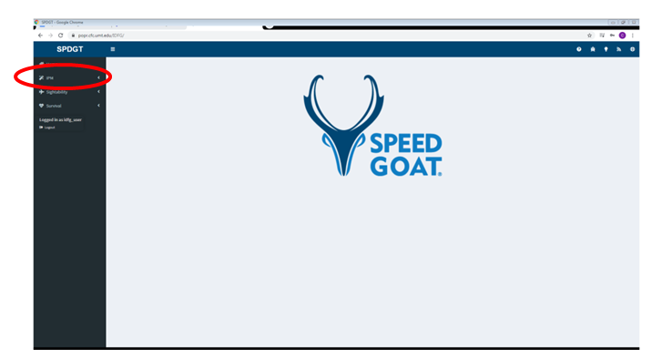

2. Select the **Setup** page in the sidebar, then select the species and DAU you want to model. Select the [IPM database](#gl-ipm-db) containing the estimates you want to use, and choose an option for incorporating [weather covariates](#gl-ipm-weather}.In this example we use mule deer and Bannock. Make sure to select the correct species and DAU before clicking the button to load harvest data.

3. Click the button labeled "Fetch Harvest Data" to load the data for the species and DAU you selected.

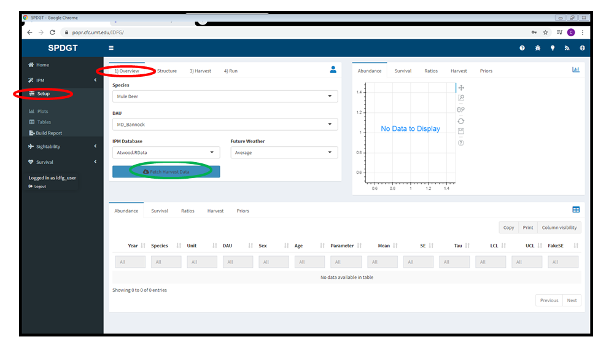

4. Once the data is loaded you should see a dialog indicating that the process was successful. Click Dismiss. If you receive an error see the [errors](#ipm-errors) section.

5. Review the data in the panes to the right and tables at the bottom (see [Loading Data](#ipm-load) for details).

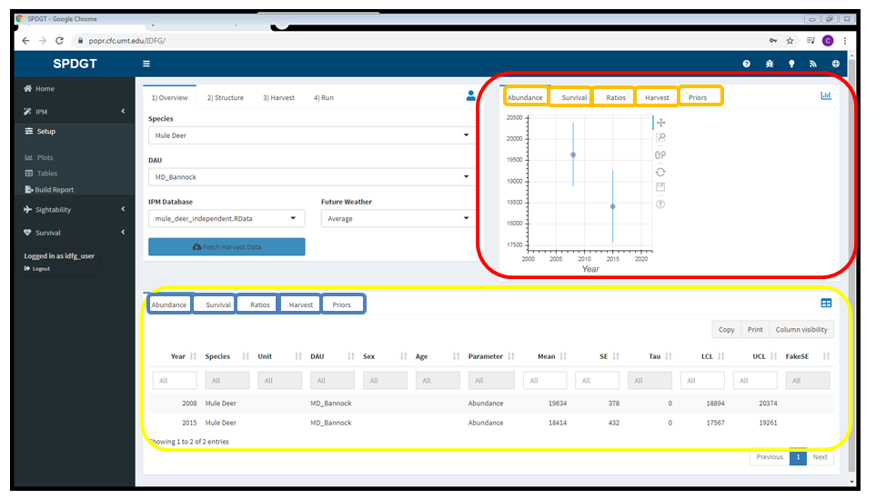

6. In this example, the abundance data that will be used by the IPM was collected in the Bannock DAU in 2008 and 2015 shown in the graph in the upper right (red rectangle) and in the table at the bottom of the page (yellow rectangle).

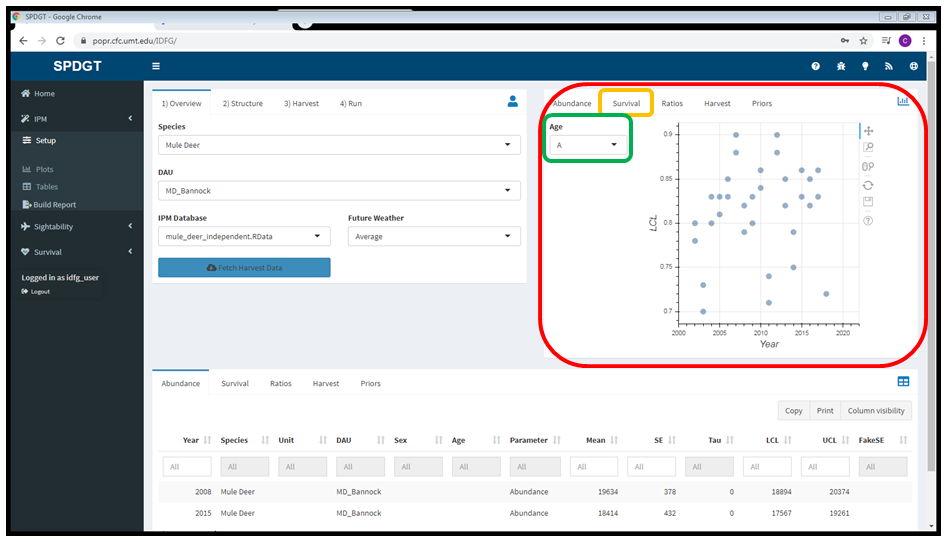

7. Move on to the [**Structure**](#ipm-options) tab and click the button to apply the default settings. Your settings should match those in the screenshot below.

8. Continue to the [**Harvest**](#ipm-options) tab to review the settings there. The defaults were used for this example, so there's no need to change anything.

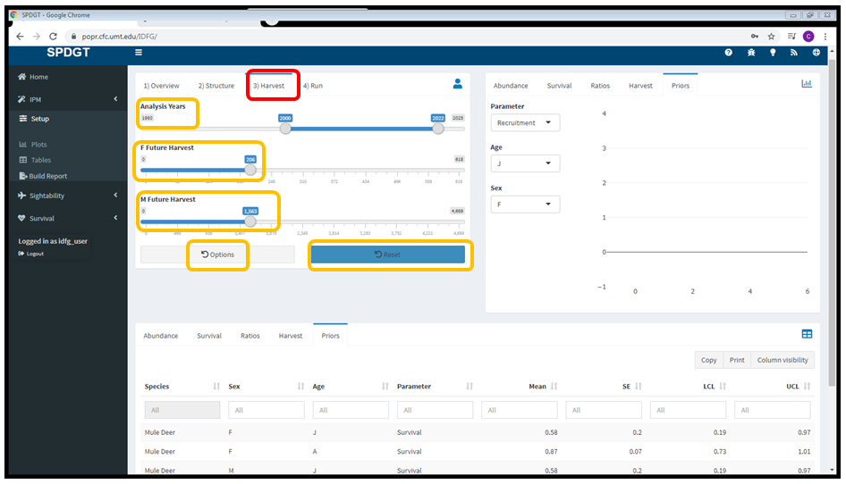

9. Now that you've selected the appropriate settings and reviewed the input data, switch to the **Run** tab. Change the burn in slider to 10,500, change the number of iterations to 41,000, and click <b>Fit Model</b>.

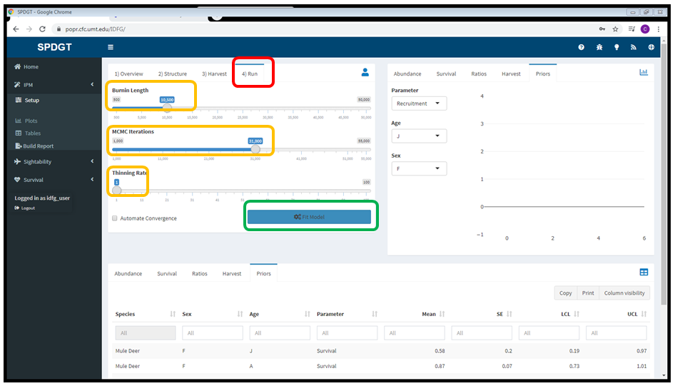

10. Once model fitting is complete select the **Plots** page in the sidebar to view the output.

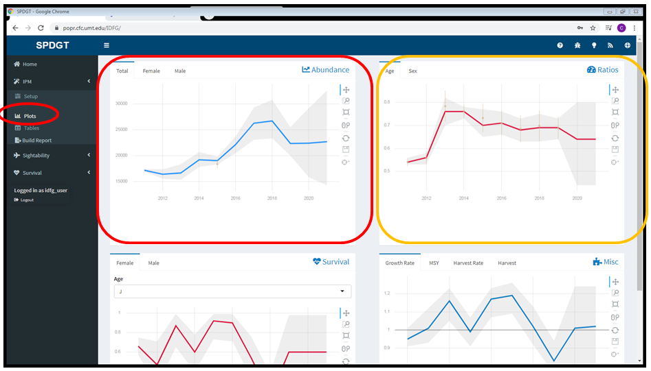

11. Check the **Tables** page as well to see how the model performed. Note the Rhat values (> 1.1) that appear in red, indicating the model may not have converged.

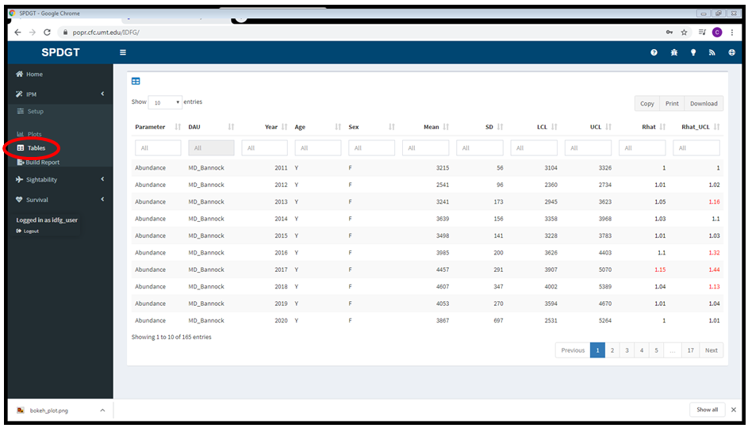

12. Now build a report to see more diagnostic information. Click **Build Report** in the sidebar, then click the download button.

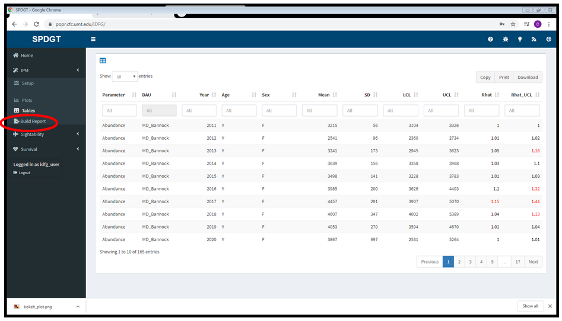

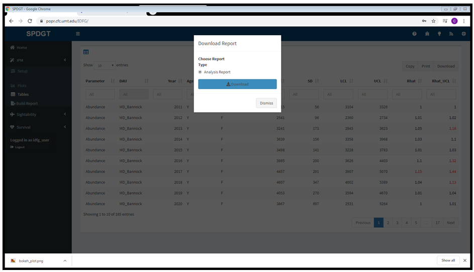

13. Notice the diagnostic section in red, indicating that the model did not converge. In some cases this may indicate problems with the data or the model structure, but sometimes we just need to let the model run longer.

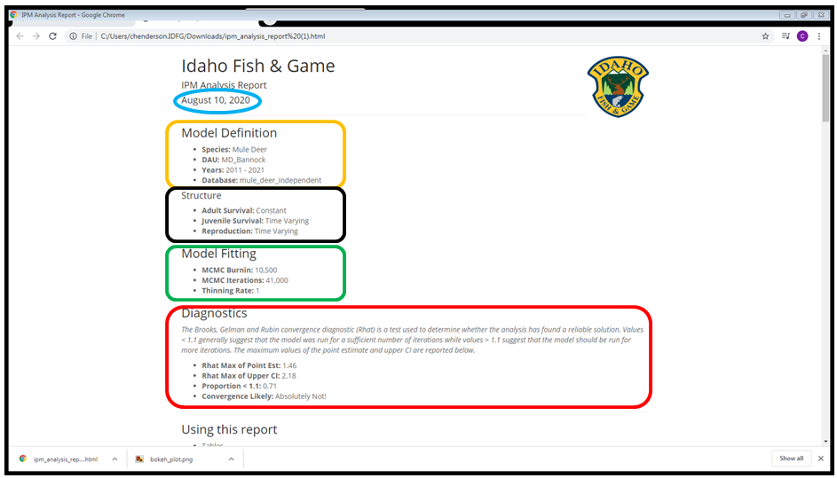

14. Return to the Run tab on the **setup** page and click the checkbox to [automate convergence](#gl-converge), then run the model again.

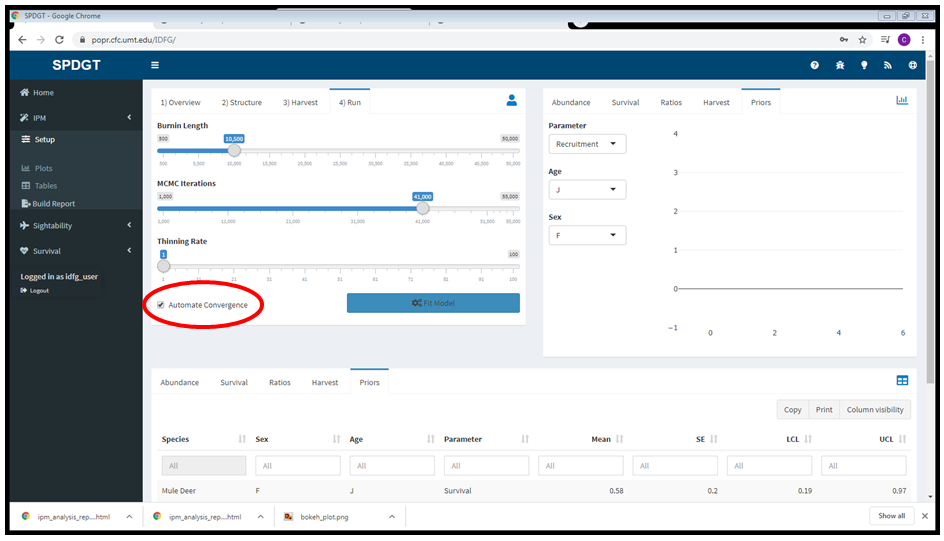

15. Build a new report and check the diagnostics section again. Allowing the model to run as long as needed resulted in much better performance.

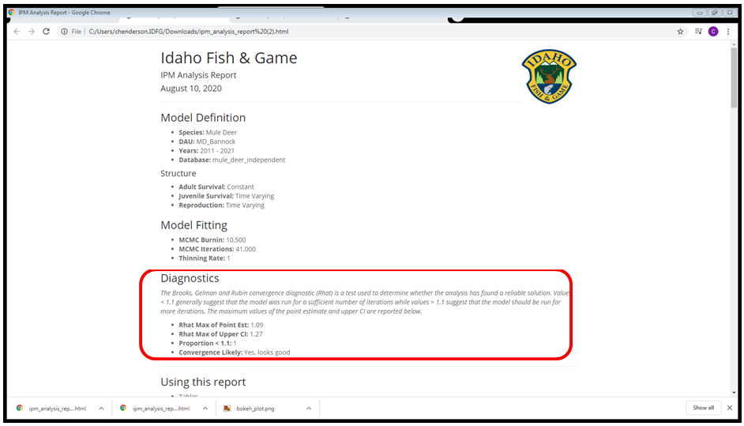

16. Check out the tables and plots in the rest of the report to review your results.

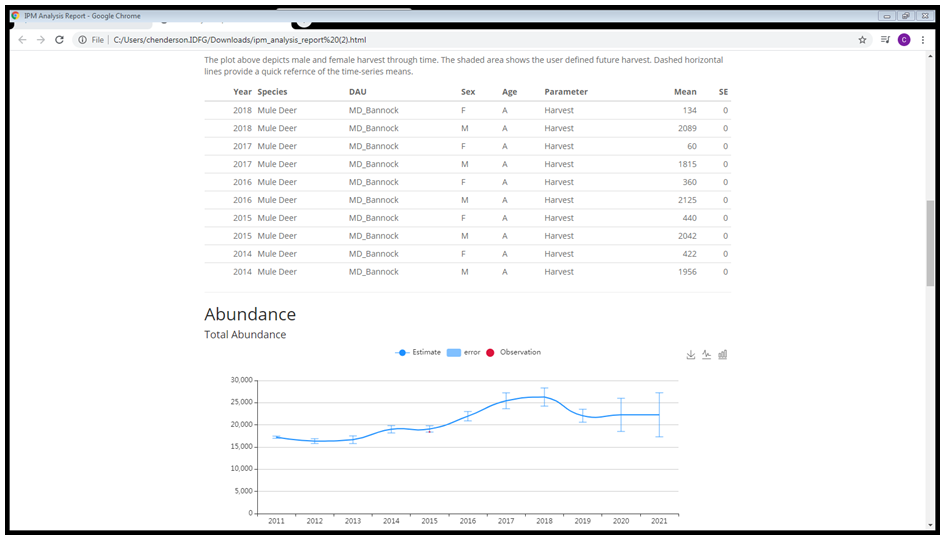

